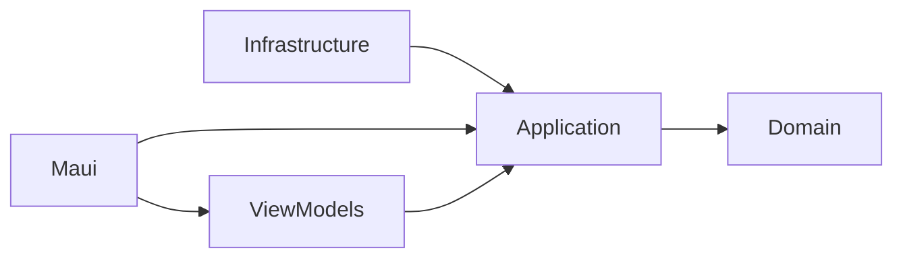

# XyloType

Do you want to learn dactylo or improve your typing precision/speed ?  
XyloType have been design in this very way  
Select you exercice, type then look at your stats.  

---
## Exercices

You can design your own exercices  
You will have to select the letters you want, text you want or dynamically generate pseudo words based on these letters.  

---
## Features

- **Layout**: a single window laid out like a JetBrains IDE: a navigation rail on the left (home, exercises editor, words, import; the open exercise or its results at the top), the theme and the main color on a right rail, a status bar at the bottom; tooltips show at once
- **Home**: choose an exercise among cards (keyboard picker); generated exercises carry a badge ("Mots inventés" or "Vrais mots"), a fixed text shows its first 20 lines; a pulsing launch button
- **Typing screen**: live coloring of each character (pending, current, correct, corrected, wrong), following the light or dark theme even when it changes during the exercise; under the current letter, the live speed (words per minute over the last 10 seconds) and a small progress bar
- **Automatic pause**: with no key for 5 seconds (at the start too), the typing pauses ("Reprendre la saisie"); 4 of these 5 seconds are taken off the clocks, 1 is kept so that waiting brings no advantage
- **Sound feedback**: on a correct key, a note played on a synthesized xylophone or on real recordings (University of Iowa Musical Instrument Samples: xylophone, piano, marimba, vibraphone, glockenspiel), or a random instrument at each exercise: a random note, or the next note of one of 48 pieces in the public domain, either instrumental pieces or songs, grouped by kind (classical, traditional, ragtime, Christmas, American folk). Pieces follow the catalog order or a random one, and a random instrument can change with each piece. The piece (its title in a bar showing its progress) and the instrument are shown under the text, with buttons for the previous, next, random, and to never use them again; a mark on the text shows where the piece changes. On an error, a low "fat" note of the same instrument. A volume per sound
- **Settings** (saved between sessions), in three animated sections: typing (back return, stop on error), display (progress bar, live speed, piece progress and mark; results shown at the end), sounds and music (volumes, instrument, notes / instrumental / songs, pieces)
- **Results**: words and letters per minute, duration, accuracy, error count; response time and error rate per key as horizontal bars, worst first, with an option to group the keys with close values; each section can be folded
- **Chaining**: from the results, retry the exercise (new words for generated exercises), go to the next one, or back home — the last played exercise stays selected
- **Exercises editor**: create, edit, delete and reorder (drag and drop) the exercises of a keyboard; a fixed text can be generated from pseudo-words or from imported words and scrolls in its own box; changes stay in memory until you save, cancel restores the saved file
- **Word import**: import a text file (compound words kept, French and Italian elisions such as "l'" dropped), each word is analyzed for the keyboard (rows, fingers, hands, dead keys) and stored in a local SQLite database; the import can be cancelled at any time and nothing is written before the end (one transaction); dynamic exercises with the "Words" source then pick real words (language, length, allowed letters, frequent words more often)
- **Import history**: each import is recorded (title, SHA-256 of the normalized text, counts); importing the same text again or a close title asks for confirmation
- **Words**: explore the imported words (contains, only these letters, language, length, occurrence range, hands, excluded), sorted on any column and paged, with the total count; columns fit the window, a cut word shows in full when hovered; exclude a word (never used in exercises, kept excluded on re-import) or restore it
- **Themes**: light, dark or system, and a main color (presets, hue and shade picking, or a hex code) applied to the whole app

---
## Statistics

- **Duration**: time from the first key press to the last character; the clock stops while the typing area has lost the focus (click outside to pause, "Reprendre la saisie" to resume), and idle time beyond 1 second is taken off when the typing pauses by itself
- **Letters per minute**: typed characters (spaces included) / duration
- **Words per minute**: letters per minute / 5 (standard word length)
- **Live speed**: words per minute over the last 10 seconds, during the exercise
- **Accuracy**: share of characters typed right the first time
- **Errors**: number of wrong key presses
- **Response time per key**: average time between the previous character and this one (capped at 5 s in the chart to ignore pauses)

---
## Roadmap
- [ ] Add user database for exercice's stats  
  - [ ] Local 
  - [ ] Online (not the priority)
- [x] From stat page, Add buttons: redo, or next exercice
- [x] Exercices settings: reorder exercice

---

# Architectue
MVVM  
Clean Architecture

---
## Technos
.NET 11 preview 6  
MAUI 11.0.0-preview.6  
🐳 Docker — runs the local Seq instance  

### NuGet packages

| Project | Package | Version | Usage |
|---|---|---|---|
| XyloType (MAUI) | CommunityToolkit.Maui | 14.2.2 | Expander, behaviors |
| | CommunityToolkit.Mvvm | 8.4.2 | Observable properties, relay commands |
| | NAudio.Wasapi | 3.1.0 | Low-latency typing sounds (WASAPI output + mixer) |
| | Serilog | 4.3.1 | Application logging |
| | Serilog.Extensions.Logging | 10.0.0 | Serilog behind `ILogger` |
| | Serilog.Sinks.Console / File / Seq | 6.1.1 / 7.0.0 / 9.1.0 | Log outputs |
| | Serilog.Enrichers.Context / CorrelationId | 4.6.5 / 3.0.1 | Log enrichment |
| | SerilogTracing | 2.4.0 | Tracing |
| | Microsoft.Extensions.Logging.Debug | 11.0.0-preview.6 | Debug output |
| XyloType.ViewModels | CommunityToolkit.Mvvm | 8.4.2 | MVVM |
| XyloType.Application | FluentValidation | 12.1.1 | Validators |
| | Microsoft.Extensions.DependencyInjection / Logging | 11.0.0-preview.6 | DI, logging abstractions |
| XyloType.Domain | Microsoft.Extensions.DependencyInjection | 11.0.0-preview.6 | DI |
| XyloType.Infrastructure | Microsoft.EntityFrameworkCore (+ Sqlite, Design, Tools) | 11.0.0-preview.6 | Local database |
| | Google.Protobuf | 3.35.1 | Exercise storage |
| | Grpc.Tools | 2.81.1 | Protobuf code generation |
| XyloType.Tests | xunit / xunit.runner.visualstudio | 2.9.3 / 3.1.5 | Test framework |
| | FluentAssertions | 8.10.0 | Assertions |
| | NSubstitute | 5.3.0 | Mocks |
| | Microsoft.NET.Test.Sdk / coverlet.collector | 18.7.0 / 6.0.4 | Test runner, coverage |

----

## 📝 Logging

The application uses Serilog for logging and Seq for structured log visualization and analysis.

### Seq visualization
Details about how to use [Seq](ReadmeSeq.md)

----

## Licence  
Mit
