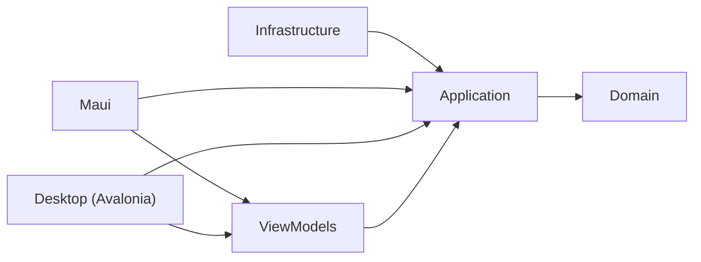

# XyloType

Do you want to learn dactylo or improve your typing precision/speed ?  
XyloType have been design in this very way  
Select you exercice, type then look at your stats.  

---
## Download

Each version is published on the [Releases](https://github.com/Zergoma/XyloType/releases) page: download
`XyloType-vX.Y-win-x64.zip`, unzip it anywhere and run `XyloType.exe` (Windows 10 1809 or later, x64; nothing to install).
The executable is not signed yet: Windows SmartScreen asks for a confirmation the first time
("More info", then "Run anyway").

### How releases are made

The [Release workflow](.github/workflows/release.yml) builds, tests and publishes the app on GitHub Actions:

- on `develop`, the app is kept for 30 days as an artifact of the run (test build);
- on `main`, a release `vX.Y` is created with the zip, `X.Y` being `ApplicationDisplayVersion` of `XyloType.csproj`:
  raise it before merging on `main`, a version that already has its release is refused.

The AI runtimes brought by the Windows App SDK (`onnxruntime.dll`, `DirectML.dll`, 38 MB) are left out: the app uses
no Windows AI API. The SDK is pinned by `global.json` (.NET 11 preview 6).

### Word packs

The words ready to use (Import > Mots, offered at the first start when the database is empty) are the assets of the
pre-release [`words`](https://github.com/Zergoma/XyloType/releases/tag/words): one `words-<language>.tsv.gz` per language
("word TAB occurrences", gzip, most frequent first) and the catalog `word-packs.json` (version, SHA-256, word count,
source books). `tools\publish-word-packs.ps1` builds them from a XyloType database (read only, excluded words left out,
`tools/XyloType.WordPackBuilder`) and replaces the assets of the release (`-DryRun` builds them only); no new version
of the app is needed.

### Exercise packs

Progressive exercises for the AZERTY keyboard (Exercices > Packs, offered at the first start with the word pack): one
pack per level, Débutant ("Premiers pas"), Intermédiaire ("Écrire en français") and Confirmé ("Vitesse et textes"),
each made of sections. They are the assets of the pre-release
[`exercises`](https://github.com/Zergoma/XyloType/releases/tag/exercises): the packs written in `packs/exercises/*.json`
and the catalog, published by `tools\publish-exercise-packs.ps1` (tests first). Installing a pack again replaces its
sections and keeps the exercises of the user.

### Desktop version (Avalonia)

`XyloType.Desktop` is the same app on [Avalonia](https://avaloniaui.net/) 12, sharing every layer but the views with the
MAUI app (domain, application, infrastructure, view models, sounds, scores and themes). It is not in the releases yet:
run it with `dotnet run --project XyloType.Desktop`. It keeps its own data in `%LOCALAPPDATA%\Xylocopadream\XyloType`
(database, `settings.json`, logs) and shares the exercise files of `Documents\XyloType` with the MAUI app.
The typing sounds use WASAPI, Windows only: on Linux and macOS the app runs silently until a cross-platform audio
output is added.

---
## Exercices

You can design your own exercices  
You will have to select the letters you want, text you want or dynamically generate pseudo words based on these letters.  
Exercises are grouped in sections, each with a level (Débutant, Intermédiaire, Confirmé) that sets the targets used to
color the results.

---
## Features

- **Layout**: a single window laid out like a JetBrains IDE: a navigation rail on the left (home, exercises editor, words, import; the open exercise or its results at the top), the theme and the main color on a right rail, a status bar at the bottom; tooltips show at once
- **Users**: several people can use the app, each with their own results; with no user yet, the app asks for one first; it starts with the user of the last session; switch from the avatar at the top right, manage them (add, rename, delete) in the users section
- **Progress**: each exercise shows if the current user has done it, with their best score; the selected one shows the worst, median and best scores; each section shows how many of its exercises are done. The score is the speed in words per minute, lowered by the share of errors
- **Home**: choose an exercise among cards grouped by section (keyboard picker); generated exercises carry a badge ("Mots inventés" or "Vrais mots", in two colors derived from the main color), a fixed text shows its first 20 lines; a pulsing launch button. Generated exercises have at most 20 lines of 20 words; their real words are picked in about a tenth of a second (only the text and the frequency of the candidates are read, the query is prepared at start)
- **Typing screen**: live coloring of each character (pending, current, correct, corrected, wrong), following the light or dark theme even when it changes during the exercise; under the current letter, the live speed (words per minute over the last 10 seconds) and a small progress bar
- **Automatic pause**: with no key for 5 seconds (at the start too), the typing pauses ("Reprendre la saisie"); 4 of these 5 seconds are taken off the clocks, 1 is kept so that waiting brings no advantage
- **Sound feedback**: on a correct key, a note played on a synthesized xylophone or on real recordings (University of Iowa Musical Instrument Samples: xylophone, piano, marimba, vibraphone, glockenspiel), or a random instrument at each exercise: a random note, or the next note of one of 48 pieces in the public domain, either instrumental pieces or songs, grouped by kind (classical, traditional, ragtime, Christmas, American folk). Pieces follow the catalog order or a random one, and a random instrument can change with each piece. The piece (its title in a bar showing its progress) and the instrument are shown under the text, with buttons for the previous, next, random, and to never use them again; a mark on the text shows where the piece changes. On an error, a low "fat" note of the same instrument. A volume per sound
- **Settings** (saved between sessions), in three animated sections: typing (back return, stop on error), display (progress bar, live speed, piece progress and mark; results shown at the end), sounds and music (volumes, instrument, notes / instrumental / songs, pieces)
- **Results**: words and letters per minute, duration, accuracy, error count; response time and error rate per key as horizontal bars, worst first, with an option to group the keys with close values; each section can be folded
- **Chaining**: from the results, retry the exercise (new words for generated exercises), go to the next one (Enter), or back home — the last played exercise stays selected
- **Results colors**: speeds, response times and errors are colored from green to red against the targets of the level of the section, with a legend
- **Exercises editor**: create, edit, delete and reorder (drag and drop) the exercises of a keyboard, in sections (add, rename, move, delete, level); a fixed text can be generated from pseudo-words or from imported words and scrolls in its own box; changes stay in memory until you save, cancel restores the saved file; a fixed text has at most 4,000 characters (counter shown; a longer text saved before is never cut, it must be shortened to be saved again)
- **Word import**: import a text file (compound words kept, French and Italian elisions such as "l'" dropped), each word is analyzed for the keyboard (rows, fingers, hands, dead keys) and stored in a local SQLite database; the import can be cancelled at any time and nothing is written before the end (one transaction); dynamic exercises with the "Words" source then pick real words (language, length, allowed letters, frequent words more often)
- **Import section**: words or a book, chosen with a selector floating at the top, the page scrolling under it
- **Word packs**: ready-to-use words taken from public domain books (French, English), downloaded from GitHub and checked (SHA-256), then imported for the chosen keyboard; offered at the first start when the database is empty. Importing a pack again, or a newer one, keeps the highest count of each word instead of adding them, and excluded words stay excluded
- **Import history**: each import is recorded (title, SHA-256 of the normalized text, counts); importing the same text again or a close title asks for confirmation
- **Words**: explore the imported words (contains, only these letters, language, length, occurrence range, hands, excluded), sorted on any column and paged, with the total count; columns fit the window, a cut word shows in full when hovered; exclude a word (never used in exercises, kept excluded on re-import) or restore it
- **Themes**: light, dark or system, and a main color (presets, hue and shade picking, or a hex code) applied to the whole app: selections, buttons, badges and status bar follow it
- **Readable main color**: with a very light main color (a bright green, a yellow), text and icons drawn on it turn dark, and the icons and links drawn with it are darkened (desktop version)
- **Shared UI library**: the rails, buttons, segmented controls, color picker, tooltips and the theme colors come from [Xylocopadream.UI.Maui](https://www.nuget.org/packages/Xylocopadream.UI.Maui) and [Xylocopadream.UI.Avalonia](https://www.nuget.org/packages/Xylocopadream.UI.Avalonia) (on nuget.org, source: [Zergoma/Xylocopadream.UI](https://github.com/Zergoma/Xylocopadream.UI))

---
## Statistics

- **Duration**: time from the first key press to the last character; the clock stops while the typing area has lost the focus (click outside to pause, "Reprendre la saisie" to resume), and idle time beyond 1 second is taken off when the typing pauses by itself
- **Letters per minute**: typed characters (spaces included) / duration
- **Words per minute**: letters per minute / 5 (standard word length)
- **Live speed**: words per minute over the last 10 seconds, during the exercise
- **Accuracy**: share of characters typed right the first time
- **Errors**: number of wrong key presses
- **Response time per key**: average time between the previous character and this one (capped at 5 s in the chart to ignore pauses)

---
## Roadmap
- [ ] Add user database for exercice's stats  
  - [x] Local 
  - [ ] Online (not the priority)
- [x] From stat page, Add buttons: redo, or next exercice
- [x] Exercices settings: reorder exercice
- [x] Desktop version with Avalonia
  - [ ] In the releases
  - [ ] Sounds on Linux and macOS (cross-platform audio output)

---

# Architectue
MVVM  
Clean Architecture

---
## Technos
.NET 11 preview 6  
MAUI 11.0.0-preview.6  
Avalonia 12.1.3 (desktop version)  
🐳 Docker — runs the local Seq instance  

### NuGet packages

| Project | Package | Version | Usage |
|---|---|---|---|
| XyloType (MAUI) | CommunityToolkit.Maui | 14.2.2 | Expander, behaviors |
| | Xylocopadream.UI.Maui | 0.1.18-preview | Rider-like controls (rails, icon buttons, segmented control, color picker, tooltips), theme and accent colors |
| | CommunityToolkit.Mvvm | 8.4.2 | Observable properties, relay commands |
| | Serilog | 4.3.1 | Application logging |
| | Serilog.Extensions.Logging | 10.0.0 | Serilog behind `ILogger` |
| | Serilog.Sinks.Console / File / Seq | 6.1.1 / 7.0.0 / 9.1.0 | Log outputs |
| | Serilog.Enrichers.Context / CorrelationId | 4.6.5 / 3.0.1 | Log enrichment |
| | SerilogTracing | 2.4.0 | Tracing |
| | Microsoft.Extensions.Logging.Debug | 11.0.0-preview.6 | Debug output |
| XyloType.Desktop (Avalonia) | Avalonia.Desktop / Avalonia.Fonts.Inter | 12.1.3 | Desktop UI, Inter font |
| | Xylocopadream.UI.Avalonia | 0.1.18 | Rider-like theme and controls (rails, theme switcher, color picker, dialogs, drag reorder), accent colors |
| | CommunityToolkit.Mvvm | 8.4.2 | Observable properties, relay commands |
| | Serilog / Serilog.Extensions.Logging / Serilog.Sinks.File | 4.3.1 / 10.0.0 / 7.0.0 | Application logging |
| XyloType.ViewModels | CommunityToolkit.Mvvm | 8.4.2 | MVVM |
| XyloType.Application | FluentValidation | 12.1.1 | Validators |
| | Microsoft.Extensions.DependencyInjection / Logging | 11.0.0-preview.6 | DI, logging abstractions |
| XyloType.Domain | Microsoft.Extensions.DependencyInjection | 11.0.0-preview.6 | DI |
| XyloType.Infrastructure | Microsoft.EntityFrameworkCore (+ Sqlite, Design, Tools) | 11.0.0-preview.6 | Local database |
| | NAudio.Wasapi | 3.1.0 | Low-latency typing sounds (WASAPI output + mixer), shared by both apps |
| | Google.Protobuf | 3.35.1 | Exercise storage |
| | Grpc.Tools | 2.81.1 | Protobuf code generation |
| XyloType.Tests | xunit / xunit.runner.visualstudio | 2.9.3 / 3.1.5 | Test framework |
| | FluentAssertions | 8.10.0 | Assertions |
| | NSubstitute | 5.3.0 | Mocks |
| | Microsoft.NET.Test.Sdk / coverlet.collector | 18.7.0 / 6.0.4 | Test runner, coverage |

----

## 📝 Logging

The application uses Serilog for logging and Seq for structured log visualization and analysis.

### Seq visualization
Details about how to use [Seq](ReadmeSeq.md)

----

## Licence  
Mit
